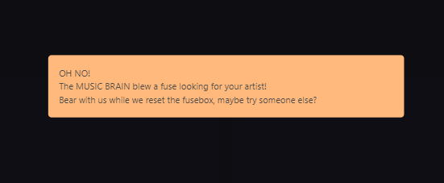

# Music Brain

Music Brain is an online tool that all music enthusiasts can get on board with. Finding out more about your favourite artist can be a chore as there is information all over the place and usually you have to scroll and read through paragraph after paragraph. What if you could get all the information you needed, all in one place just at the touch of a button? That's exactly what music brain is for.

Music brain is a centralised area where our user can search up their artist of choice. It will then output a quick paragraph about the artist, a picture of them, their top 5 songs with built in YouTube videos to be able to listen to them. No more visiting 50 different websites just to find out some more about your favourite artist.

## Installation
### GitHub installation
1. Clone the GitHub repository to your preferred location with `git clone https://github.com/Tim-KS/Music-Search-Webpage.git`
2. Go into the folder and open 'index.html'
3. The program will be ready to use

Otherwise follow the deployed link to test the application.

## Usage

Depending on where you are launching the application from (code editor or deployed link) you will land on the homepage.

The app title can be found on the left hand side of the screen, with the input box directly below it. Enter the artist to be searched and click the orange "Search Artist" button found directly. Please refer to the screen shot below for an example of what it will look like:

 

Once the "Search Artist" button has been clicked the content will retrieved from Wikipedia and Youtube and loading their resepctive tiles. See an image below for an example of what that looks like:

If an error occurs, such as invalid user input, a full screen modal will pop up telling the user there as been an error occur. They have to click on the white 'X' in the top RH corner to close it. Please see the image below for what it would look like:

 

## Credits

### Collaborators
- Sanket Panchal: https://github.com/DancingSandwich
- Rosemary Forster: https://github.com/RosemaryJF
- Jonathan Wijaya: https://github.com/jonnwijaya
- Tim Kandan-Smith: https://github.com/Tim-KS

### Third-party assets
- YouTube v3 API
- Wikipedia
- Bulma

## Features
- Instantly search for a music artist
- Biography of artist
- Their Top 5 media videos
- Built in YouTube player

## Planned features
- Lyrics to play along with song
- Improved efficiency of engine (be able to even search for highly niche artists)
- Save your favourite artists
